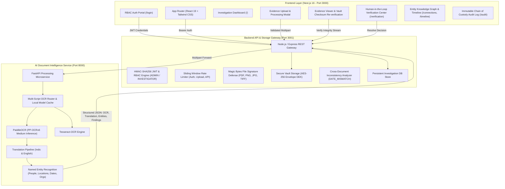

# CASEINTEL - Secure Legal DMS & Document Intelligence Platform

> **Hackathon-Ready, Reliable, Secure, and Production-Grade Legal Intelligence & Evidence Vault Platform.**

CaseIntel is a full-stack legal Document Management System (DMS) and Investigation Intelligence Platform built for Indian law enforcement, cybercrime units, and judicial workflows. It enables cryptographic envelope encryption at rest, Indian regional language OCR and translation, Named Entity Recognition (NER), cross-document inconsistency detection, human-in-the-loop verification, and immutable chain-of-custody audit logging.

---

## 🏛️ System Architecture



### 🔍 Backend Source of Truth Clarification
- **Source of Truth:** `BACKEND/node-service` (Node.js/Express) is the unified, active backend API gateway and storage vault.
- **Java Service Status:** `BACKEND/java-service` was a skeletal prototype stub (`/metadata/register`). The host machine does not have a Java Runtime or Maven installed (`Unable to locate a Java Runtime`). All functionality is consolidated into the Node.js service for stability, zero-latency local development, and hackathon demo reliability. Outdated Java references have been replaced.

---

## ⚡ Quick Start (One Command)

To run the entire platform (AI Service + Backend API + Next.js Frontend) in one command:

```bash
# 1. Make scripts executable
chmod +x run_services.sh generate_demo_docs.py

# 2. Generate controlled fictional demo documents
python3 generate_demo_docs.py

# 3. Launch all 3 services
./run_services.sh
```

### Services Access URLs:
- 🌐 **Web Application:** [http://localhost:3000](http://localhost:3000)
- 🔑 **Auth Portal:** [http://localhost:3000/login](http://localhost:3000/login)
- 🔒 **Backend API & Health Check:** [http://localhost:3001/api/v1/health](http://localhost:3001/api/v1/health)
- 🤖 **AI Microservice Swagger Docs:** [http://localhost:8000/docs](http://localhost:8000/docs)

---

## 🧪 Automated End-to-End Critical Path Test

Run the full-stack automated test suite verifying all 12 critical path requirements:

```bash
node test_fullstack.js
```

### Requirements Verified:
1. ✅ **Health Checks** (Backend & AI Microservice)
2. ✅ **Authentication** (JWT generation and validation)
3. ✅ **RBAC Authorization** (`INVESTIGATOR` vs `ADMIN`)
4. ✅ **Unauthorized Access Enforcement** (Tampered tokens rejected with HTTP 401/403)
5. ✅ **Case Creation** (`POST /api/v1/cases`)
6. ✅ **File Security & Magic Bytes Defense** (Malformed/executable files rejected with HTTP 400)
7. ✅ **Document 1 Upload (FIR)** + AES-256 Envelope Encryption + SHA-256 Checksum
8. ✅ **AI OCR & Entity Extraction** (Identifies incident date: `12 August 2026`, location: `Siliguri`, person: `Rahul Sharma`)
9. ✅ **Document 2 Upload (Investigation Report)** (Incident date: `14 August 2026`)
10. ✅ **Cross-Document Analysis** (Automatically flags `DATE_MISMATCH` inconsistency)
11. ✅ **Human Verification Center** (Investigator confirms Source A)
12. ✅ **Cryptographic Vault Integrity Re-verification** (In-memory decrypted stream SHA-256 match)
13. ✅ **Append-Only Audit Trail** (`DOCUMENT_UPLOADED`, `HASH_GENERATED`, `OCR_COMPLETED`, `FINDING_CREATED`, `INTEGRITY_VERIFIED`)

---

## 🔐 Preconfigured Demo User Accounts

| Role | Username / Email | Password | Assigned Persona & Department |
| :--- | :--- | :--- | :--- |
| **`INVESTIGATOR`** | `investigator` or `investigator@caseintel.local` | `Investigator123!` | Inspector Rajesh Verma · Cyber Crime Division |
| **`ADMIN`** | `admin` or `admin@caseintel.local` | `Admin123!` | Director Sharma · Special Operations |

---

## ⏱️ 3-Minute Live Hackathon Demo Script

| Time | Screen | Action & Narration | Expected System Output |
| :--- | :--- | :--- | :--- |
| **0:00 - 0:30** | `/login` | Click **Sign In as Investigator** (`investigator`). Highlight JWT auth, rate limiting, and RBAC role assignment. | Redirects to Dashboard. Topbar displays `Inspector Rajesh Verma (Cyber Crime)` and blue `INVESTIGATOR` badge. |
| **0:30 - 1:00** | `/cases` | Click **New Case**, title: `Siliguri Cyber Fraud Dossier` (`CASE-001`), priority: `High`. | Case created; audit log records `CASE_CREATED`. |
| **1:00 - 1:45** | `/documents` | Click **Upload Document**, select `sample_fir.png` (Type: `FIR`). Show upload modal stages: Envelope Encryption $\rightarrow$ AI OCR $\rightarrow$ Vault Storage. | Document vaulted (`DOC-001.enc`). SHA-256 hash computed. OCR extracts date: `12 August 2026`, person: `Rahul Sharma`, location: `Siliguri`. |
| **1:45 - 2:15** | `/documents` | Upload second document `sample_investigation_report.png` (Type: `Investigation Report`). | System automatically correlates documents, detects conflicting date (`14 August 2026` vs `12 August 2026`), and creates `DATE_MISMATCH` finding. |
| **2:15 - 2:35** | `/verification` | Navigate to **Verification Center**. Review side-by-side comparison of FIR vs Investigation Report. Click **Confirm Source A**. | Status updates to `Source A Confirmed`. Action logged as `FINDING_CONFIRMED` in audit trail. |
| **2:35 - 2:50** | `/documents/DOC-001` | Open Evidence Viewer for `DOC-001`. Click **Verify Vault Cryptographic Integrity**. | Backend decrypts AES-256 stream in memory, recomputes SHA-256, and displays green badge: `✓ Cryptographic Integrity Verified: 100% Match`. |
| **2:50 - 3:00** | `/audit` & `/connections` | Show immutable audit trail with standard enums and dynamic knowledge graph connecting Case, Evidence, Person, and Dates. | Proof of digital chain of custody. Real dynamic statistics on Dashboard. |

---

## 🔒 Security Hardening

- **Magic Bytes Validation:** Validates initial buffer signatures (`%PDF-`, `\x89PNG`, `\xFF\xD8\xFF`, `TIFF`) before processing.
- **Envelope Encryption:** Plaintext files are encrypted with ephemeral 256-bit DEKs using AES-256-CBC, wrapped with AES-256-GCM.
- **Sliding-Window Rate Limiting:** Enforces limits on login (15/min), document uploads (30/min), and API calls (300/min).
- **Sanitized File Paths:** Strips path traversal characters (`..`, `/`, `\`) to eliminate traversal vulnerabilities.
- **Truthful Metrics:** Removed fake hardcoded accuracy claims ("94.8%"). Dashboard displays dynamic counts and evaluated OCR confidence averages.

---

## 📄 License & Governance

CaseIntel is licensed for authorized investigative and law enforcement use. See [Privacy Policy](/privacy) and [Terms of Service](/terms).
