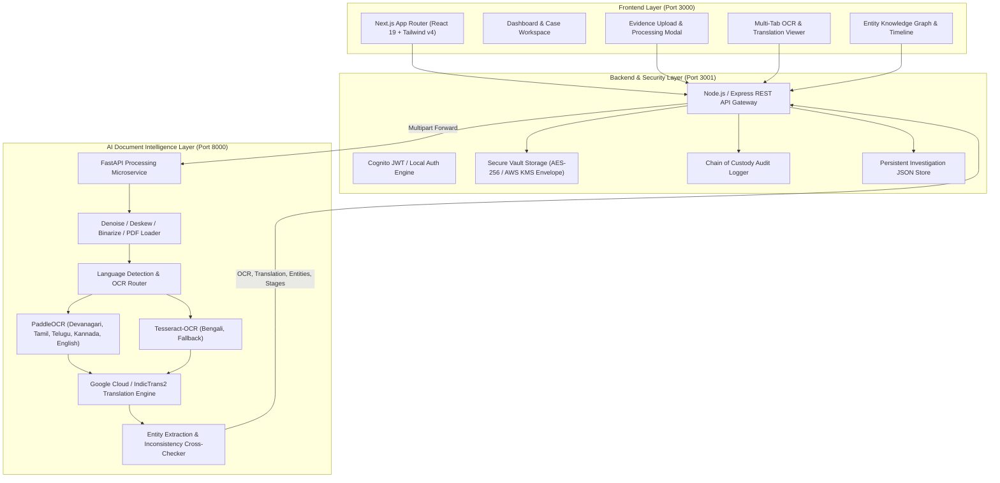

# CASEINTEL - Secure Legal DMS & Multi-Lingual AI Intelligence Platform

A production-grade, full-stack legal Document Management System (DMS) and Investigation Platform designed for Indian law enforcement, legal firms, and judiciary workflows.

---

## 🏛️ System Architecture



---

## 🚀 Quick Start (One Command)

To run the entire full-stack platform (AI Service + Backend API + Next.js Frontend) in one command:

```bash
# Make the startup script executable (if not already)
chmod +x start.sh

# Start the full stack
./start.sh
# or
npm run dev
```

Once started:
- 🌐 **Web Application:** [http://localhost:3000](http://localhost:3000)
- 🔒 **Backend API & Health Check:** [http://localhost:3001/api/v1/health](http://localhost:3001/api/v1/health)
- 🤖 **AI Microservice Swagger Docs:** [http://localhost:8000/docs](http://localhost:8000/docs)

---

## 🧩 Services Overview

### 1. `FRONTEND` (Next.js 16 + React 19 + Tailwind v4)
- **Directory:** `FRONTEND/`
- **Port:** `3000`
- **Features:**
  - **Investigation Dashboard:** Real-time metrics for active cases, encrypted documents, pending human verifications, and system health status.
  - **Upload & Automated Pipeline:** Drag-and-drop file upload modal supporting scanned Indian language FIRs (PDF, PNG, JPG).
  - **Document Intelligence Viewer:** Multi-tab document inspector showing Raw OCR Text, English Translation, Structured Form, and Extracted Entities (People, Locations, Dates, Organizations).
  - **Case Workspaces:** Deep dive into specific cases with dedicated tabs for Evidence Documents, AI Findings, Verification Issues, Timelines, and Audit Records.
  - **Verification Center:** Human-in-the-loop review interface for resolving conflicting evidence (e.g. date mismatches between FIR and investigation reports).
  - **Connections Knowledge Graph:** Visual graph mapping cases to documents and extracted persons, locations, and dates.
  - **Audit Logs:** Immutable chain of custody table recording every upload, OCR pass, and human verification decision.

### 2. `BACKEND` (Node.js & Express Storage API)
- **Directory:** `BACKEND/node-service/`
- **Port:** `3001`
- **Features:**
  - **Envelope Encryption:** Every file is encrypted using a cryptographic envelope before hitting storage. Supports **AWS KMS** with automatic fallback to local master-key AES-256 envelope encryption for offline/local development.
  - **Decryption on Demand:** Authenticated stream decryption for downloading original evidence files.
  - **File Integrity:** Generates SHA-256 cryptographic hashes for chain of custody verification.
  - **Pipeline Orchestrator:** Seamlessly forwards uploads to the AI microservice, persists entities, updates timelines, and flags cross-document inconsistencies.
  - **Chain of Custody:** Automatically records audit log entries for every system and user action.

### 3. `AI` (Python FastAPI + PaddleOCR + Tesseract + IndicTrans)
- **Directory:** `AI/`
- **Port:** `8000`
- **Features:**
  - **OCR Engine Routing:** Smart routing directing Devanagari (Hindi), Tamil, Telugu, and Kannada to PaddleOCR, and Bengali to Tesseract.
  - **Language Auto-Detection:** Heuristic multi-script scanner that scores confidence across candidate languages.
  - **Translation Engine:** Multi-lingual translation pipeline to English with automatic fallback handling.
  - **Entity Extraction:** Extracts Accused/Suspect names, police stations/locations, dates of occurrence, and departments.
  - **PDF & Image Support:** Multi-page PDF ingestion powered by `pypdfium2` and `preprocess.py`.

---

## 🛠️ Individual Service Commands

If you prefer running each service in a separate terminal:

### Terminal 1: AI Microservice
```bash
cd AI
./.venv/bin/python -m uvicorn api:app --host 127.0.0.1 --port 8000 --reload
```

### Terminal 2: Backend API
```bash
cd BACKEND/node-service
node server.js
```

### Terminal 3: Frontend Dashboard
```bash
cd FRONTEND
npm run dev
```

---

## ⚙️ Configuration & Environment Variables

### Backend Configuration (`BACKEND/node-service/.env`)
```ini
PORT=3001
AI_SERVICE_URL=http://127.0.0.1:8000
ALLOWED_ORIGIN=http://localhost:3000

# Optional AWS Credentials for KMS & Cognito in Production:
AWS_REGION=us-east-1
COGNITO_USER_POOL_ID=us-east-1_xxxxxxxxx
COGNITO_CLIENT_ID=xxxxxxxxxxxxxxxxxxxxxxxx
KMS_MASTER_KEY_ID=arn:aws:kms:us-east-1:123456789012:key/xxxx-xxxx-xxxx-xxxx
```
*(Note: If AWS credentials are not provided, the backend automatically operates in Local Development Mode with AES-256 envelope encryption and local user authentication.)*

### Frontend Configuration (`FRONTEND/.env.local`)
```ini
NEXT_PUBLIC_API_URL=http://localhost:3001/api/v1
NEXT_PUBLIC_AI_URL=http://localhost:8000
```

---

## 🧪 Verification & Health Check

1. **Verify Backend Health:**
   ```bash
   curl http://localhost:3001/api/v1/health
   ```
2. **Verify AI Health:**
   ```bash
   curl http://localhost:8000/health
   ```
3. **Verify Supported Languages:**
   ```bash
   curl http://localhost:8000/languages
   ```
